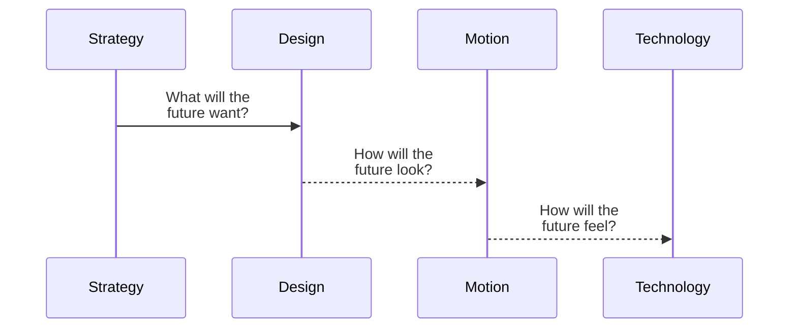

# .github
About
# F I C T I O N   T R I B E°

# Who we are

Hello. We're Fiction Tribe. We believe that creative matters—that when everyone is doing the same thing, doing something different is paramount.  

We combine technology, storytelling, strategy, art, and film to help brands big and small connect with audiences in a way that moves them. Take a look at some of the things we’ve helped create, who we work with, and let's talk.

## Creative That Creates Results

We disrupt the typical agency model by living in real-time. Using massively disconnected data to find audience insights, trusted processes to integrate systems in new ways, and creative thinking, we are changing how stories are made.

Our clients have amazing stories to share. We implement radical new approaches to digital marketing at scale and cost savings. We embrace the hard work that marketing requires, and the new ways of thinking to get it done.

Our experience with today's toolsets offers clients unmatched deployment times, stellar creative, targeted messaging, relevant distribution and actionable analytics.

Let's go.

## Portfolio
See our work  [fictiontribe.com](https://fictiontribe.com)

## Blog
Read our posts   [blog.fictiontribe.com](https://blog.fictiontribe.com)

## Films
Watch our videos   [vimeo.com/fictiontribe](https://vimeo.com/fictiontribe)

## Fun
Explore endless AI prompts for ChatGPT and MidJourney   [fictiontribe.fun](https://fictiontribe.fun)

## Social

[LinkedIn](https://www.linkedin.com/company/fictiontribe/)
 
[Instagram](https://www.instagram.com/fictiontribe/)

## Org Chart

We are structured to build the future.

